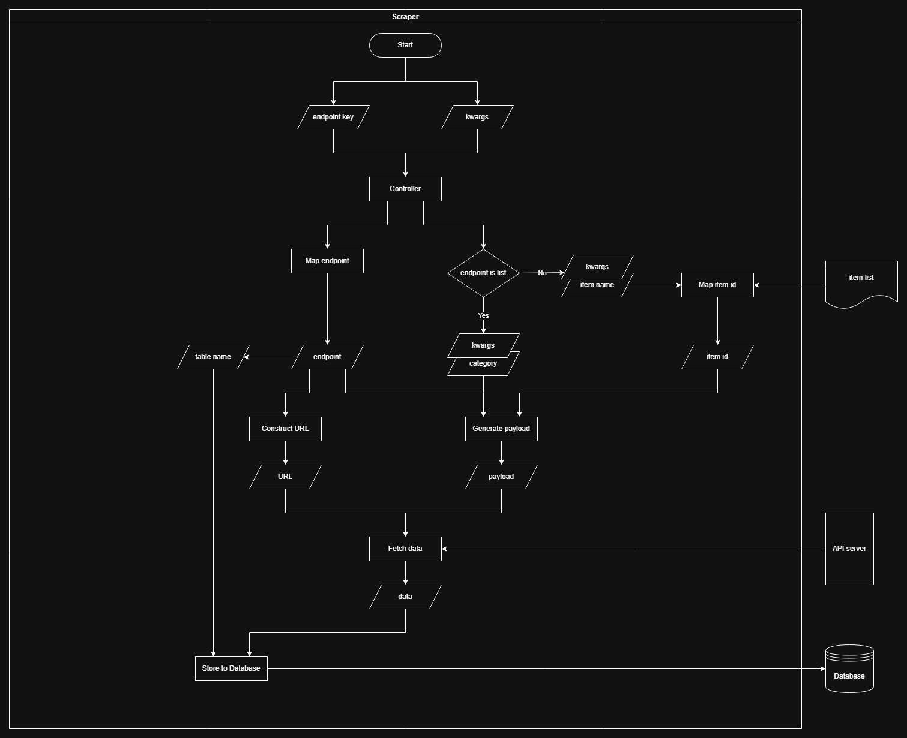
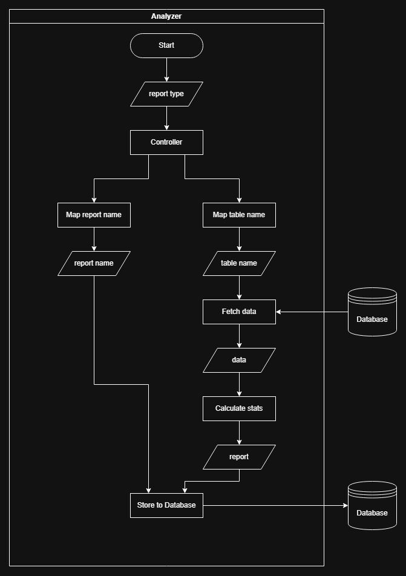

# Guild Applications
An application server design to serve my another project [Discord Bot](https://github.com/RyanYCT/discord-bot)

## About This Project
A specialized Discord server application that provides market analysis for Black Desert Online's Central Market. Built using Flask, this application serves as a data collection and analysis hub that works in conjunction with a Discord bot to deliver market insights to community.

## Features
- **Market Data Collection**
    - Automated price tracking
    - Item stock monitoring
    - Market trend analysis
    - Historical data collection
    - Regular market updates

- **Data Analysis**
    - Rate of return calculations
    - Price trend analysis
    - Market volume tracking

- **API Integration**
    - RESTful API endpoints for Discord bot
    - BDO Market API integration
    - Automated report generation
    - Real-time data synchronization

## System Architecture
- **ETL Pipeline**
  - Scraper: Data collection from BDO Market API
  - Analyzer: Data processing and statistical analysis
  - Database: PostgreSQL for data storage
  - API Server: Flask RESTful endpoints

## Deployment Guide
### Prerequisites
1. Python 3.10 or higher
2. Database server (PostgreSQL prefer)

### Deploying with Docker
1. Ensure Docker is installed
    ```bash
    docker version
    ```
2. Clone the repository and navigate into the project directory
    ```bash
    git clone https://github.com/RyanYCT/discord-server-app.git
    cd discord-server-app
    ```
3. Setting Up Environment Variables and Database Server
    <details>

    ### Setting Up Environment Variables
    1. Copy the `.env.example` in the root of the project
    2. Rename it to `.env`
    3. Replace the placeholders in `.env` with the actual information and database credentials
    </details>
4. Build and run the Docker container
    ```bash
    docker-compose up --build
    ```
### Deploying with Traditional Server 
1. Clone the repository and navigate into the project directory
    ```bash
    git clone https://github.com/RyanYCT/discord-server-app.git
    cd discord-server-app
    ```
2. Create and activate virtual environment
    ```bash
    python -m venv .venv
    .venv/bin/activate
    ```
3. Install requirements
    ```bash
    pip install -r requirements.etl.txt
    pip install -r requirements.api.txt
    ```
4. Run the ETL scheduler
    ```bash
    python -m scheduler.py
    ```
5. Run the API Server
    ```bash
    gunicorn --bind 0.0.0.0:5000 api.app:app
    ```

## Workflow
1. **Define Target**:
    - Noteworthy items are listed as json in `Scraper/itemlist.json`. This list is intended to help filter out unwant items at first when searching by category.

2. **Collect Data**:
    - The `Scraper` module is responsible for collecting data from the market. It fetches information and stores the data in the database classify and naming by source endpoint.

3. **Analyze Data**:
    - The `Analyzer` module processes the collected data, analyze the statistics of items. It generate report and stores the results in the database classify and naming by report type.

4. **Render Reports via RESTful API**:
    - The Flask application `app.py` serves as the backend, exposing RESTful API endpoints.
    - These endpoints allow the Discord bot to request the reports then render these reports in Discord channels.

## Scraper
The scraper module handles BDO market data collection.

### Features
- Item price tracking
- Stock level monitoring
- Market volume tracking
- Historical data collection

### Configuration
- Items to track are defined in `Scraper/item_list.json`
- Data is classified and stored by source endpoint
- Automated periodic data collection

### Workflow


## Analyzer
The analyzer module processes market data and generates insights.

### Capabilities
- Rate of return calculations
- Price trend analysis
- Market performance rankings
- Volume analysis
 
### Analysis Features
- Enhancement level comparison
- Stock level monitoring
- Historical price tracking

### Workflow


## Report Types
The reports that would be posted by the bot are similar to the following:

### Top Performers (Profitable)
Overall ranking list that sorted by rate of return, reveal the best item at the time.

| name   | enhance | price        | profit          | rate     | stock |
|--------|---------|--------------|-----------------|----------|-------|
| item01 | 5       | 35200000000  | 26535867605.0   | 7.386767 | 4     |
| item02 | 3       | 12500000000  | 9372487605.0    | 7.106571 | 0     |
| item03 | 1       | 150000000000 | 111284330105.0  | 6.619053 | 0     |
| ...    | ...     | ...          | ...             | ...      | ...   |
| item97 | 0       | 4440000      | -23420474805.0  | 0.145388 | 63    |
| item98 | 0       | 8250000      | -227360568207.5 | 0.145277 | 101   |
| item99 | 5       | 0            | -8124244895.0   | 0.14525  | 0     |

### Top Performers (Category specific)
Similar to overall ranking with a filter for particular type of item.

| name   | enhance | price        | profit          | rate     | stock |
|--------|---------|--------------|-----------------|----------|-------|
| A Ring | 3       | 12500000000  | 9372487605.0    | 7.106571 | 0     |
| B Ring | 1       | 150000000000 | 111284330105.0  | 6.619053 | 0     |
| C Ring | 5       | 31400000000  | 23133962605.0   | 6.336776 | 4     |

## Endpoints
RESTful API endpoints for Discord bot integration.

### Profitability Report
    ```
    GET /report
    ```
Returns:
- Top performing items
- Volume statistics


# References
BDO API: [veliainn](https://developers.veliainn.com/)

BDO Market API: [BDO Market API](https://documenter.getpostman.com/view/4028519/TzK2bEVg#intro)
